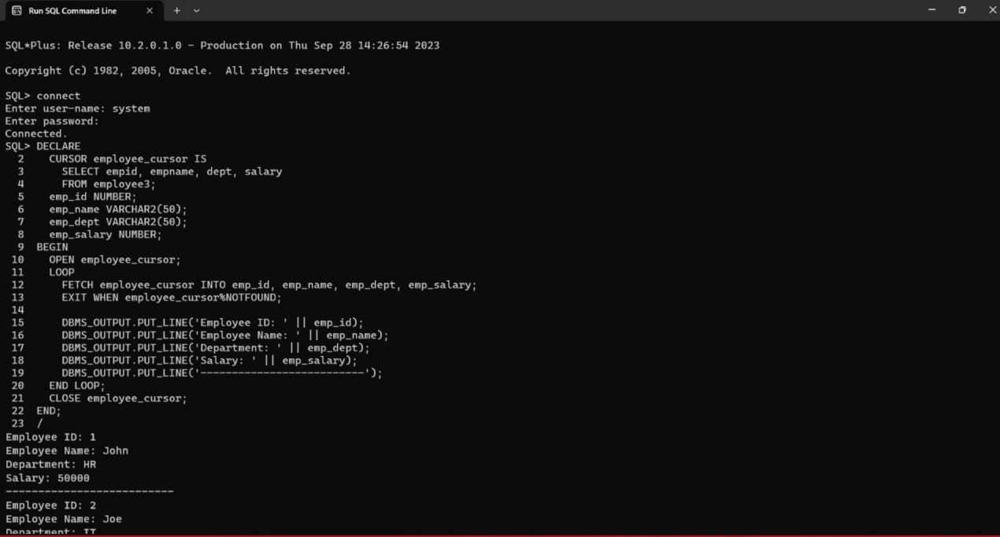
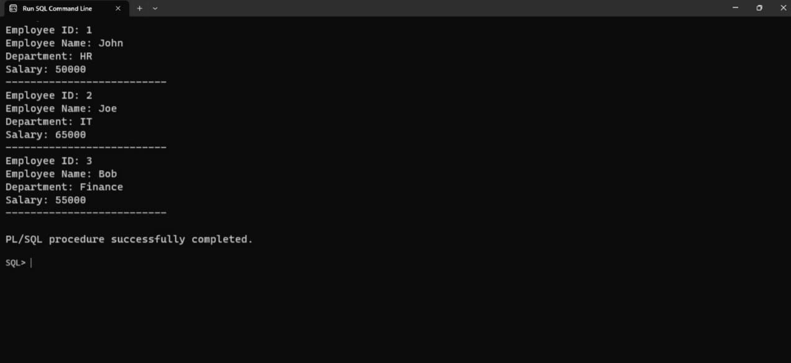

# Ex. No: 6 Creating Cursors using PL/SQL

## AIM: 
To create a cursor using PL/SQL.

## Steps:
1. Create employee table with following attributes (empid NUMBER, empname VARCHAR(10), dept VARCHAR(10),salary NUMBER);
2. Create a cursor named as employee_cursor
3. Using cursor read each record and display the result
4. Close the cursor

## Program:
### Create employee table
```
create table EMPLOYEE3 (empid NUMBER, empname VARCHAR(20), dept VARCHAR(10),salary NUMBER);
```
### PLSQL Cursor code
```
DECLARE
  2    CURSOR employee_cursor IS
  3      SELECT empid, empname, dept, salary
  4      FROM employee3;
  5    emp_id NUMBER;
  6    emp_name VARCHAR2(50);
  7    emp_dept VARCHAR2(50);
  8    emp_salary NUMBER;
  9  BEGIN
 10    OPEN employee_cursor;
 11    LOOP
 12      FETCH employee_cursor INTO emp_id, emp_name, emp_dept, emp_salary;
 13      EXIT WHEN employee_cursor%NOTFOUND;
 14
 15      DBMS_OUTPUT.PUT_LINE('Employee ID: ' || emp_id);
 16      DBMS_OUTPUT.PUT_LINE('Employee Name: ' || emp_name);
 17      DBMS_OUTPUT.PUT_LINE('Department: ' || emp_dept);
 18      DBMS_OUTPUT.PUT_LINE('Salary: ' || emp_salary);
 19      DBMS_OUTPUT.PUT_LINE('--------------------------');
 20    END LOOP;
 21    CLOSE employee_cursor;
 22  END;
 23  /
```
## Output:


## Result:
Hence cursor has been created using PL/SQL.
